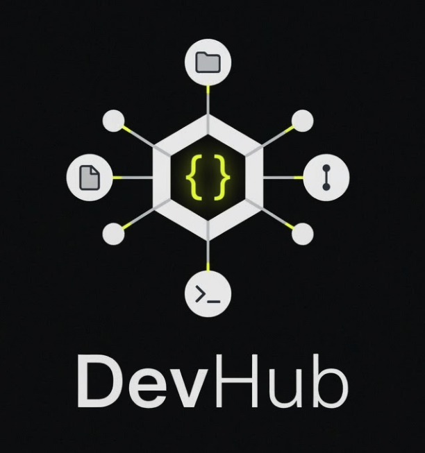

<div align="center">



A local-first development environment manager — start, stop, and monitor your macOS projects from a single dashboard with subdomain routing, port management, and real-time log streaming.

[](https://nextjs.org/)
[](https://www.typescriptlang.org/)
[](https://www.sqlite.org/)
[](https://tailwindcss.com/)
[](LICENSE)

</div>

---

<!-- Uncomment and add a screenshot when available -->
<!--  -->

## Features

### Project Management
- **Auto-Discovery** — Scan workspace roots to detect Node, Laravel, and Expo projects automatically
- **Multi-Service Orchestration** — Define multiple services per project with dependency ordering, readiness checks, and restart policies
- **Stacks** — Group projects for one-click start/stop
- **`devhub.yml` Config** — Drop a config file in your project for auto-import with service definitions

### Networking
- **Port Conflict Handling** — Automatic free port assignment (range 10000–65000) when desired ports are busy
- **Subdomain Routing** — Access projects via `http://myapp.localhost:4400` or `http://myapp.localhost` (portless mode with Caddy)

### Developer Experience
- **Preflight Checks** — Detect missing `.env`, uninstalled deps, wrong Node/PHP versions, and port conflicts before starting
- **Unified Log Streaming** — Per-service and combined logs with search, filter, and error highlighting via SSE
- **Update Advisor** — Scan `npm outdated` / `composer outdated`, flag major updates, and track upgrade notes
- **Auto-Build Watcher** — File watcher with auto-rebuild and manual restart support

### Security
- **Local by Default** — Binds to `localhost` only (127.0.0.1)
- **LAN Mode** — Toggle in Settings to bind to `0.0.0.0` for network access
- **Passcode Auth** — bcrypt-based authentication with httpOnly cookie sessions (required for LAN mode)

---

## Tech Stack

| Layer | Technology |
|-------|------------|
| **Framework** | Next.js 16 (App Router, Turbopack) |
| **Language** | TypeScript (strict) |
| **UI** | shadcn/ui + Tailwind CSS v4 |
| **Database** | SQLite via better-sqlite3 (WAL mode) |
| **Real-time** | Server-Sent Events (SSE) |
| **Testing** | Vitest |
| **Platform** | macOS-first (cross-platform extensible) |

---

## Requirements

- Node.js 20+
- npm or pnpm
- macOS (primary target; Linux support planned)
- [Caddy](https://caddyserver.com/) (optional, for portless subdomain routing)

---

## Setup

```bash
# Clone the repository
git clone https://github.com/kennethsolomon/dev-hub.git
cd dev-hub

# Install dependencies
npm install

# Start development server
npm run dev
```

DevHub runs on `http://localhost:9000` by default.

---

## Configuration

### Workspace Roots

Go to **Settings > Workspace Roots** and add directories to scan. DevHub auto-discovers:

- **Node/JS** — has `package.json`
- **Laravel** — has `artisan` + `composer.json`
- **Expo/React Native** — has `app.json` + expo dependency

### `devhub.yml`

Projects can include a `devhub.yml` config file for auto-import:

```yaml
services:
  - name: dev
    command: npm run dev
    port: 3000
    primary: true
  - name: worker
    command: npm run worker
    dependsOn: [dev]
  - name: redis
    command: redis-server
    port: 6379
    readiness:
      type: tcp
      port: 6379
```

### Subdomain Routing (Portless Mode)

By default, projects are accessible via `http://<slug>.localhost:4400`.

To remove the port from URLs:

1. Install Caddy: `brew install caddy`
2. Run the install script: `sudo ./scripts/install-portless.sh`
3. Enable **Portless Mode** in Settings
4. Access projects at `http://<slug>.localhost`

```bash
# Uninstall portless mode
sudo ./scripts/uninstall-portless.sh
```

---

## API Routes

| Method | Route | Description |
|--------|-------|-------------|
| GET/POST | `/api/projects` | List / create projects |
| POST | `/api/projects/[id]/start` | Start all project services |
| POST | `/api/projects/[id]/stop` | Stop all project services |
| GET | `/api/projects/[id]/preflight` | Run preflight checks |
| POST | `/api/projects/[id]/quickfix` | Auto-fix preflight issues |
| GET | `/api/projects/[id]/updates` | Check for dependency updates |
| GET/POST | `/api/services` | List / create services |
| POST | `/api/services/[id]/start` | Start individual service |
| POST | `/api/services/[id]/stop` | Stop individual service |
| GET/POST | `/api/stacks` | Service group management |
| GET | `/api/status` | Running processes + routing table |
| GET | `/api/logs/stream` | SSE log streaming |
| POST | `/api/proxy/forward` | Subdomain proxy handler |
| GET/PUT | `/api/settings` | App configuration |
| POST | `/api/auth` | Session management |
| GET | `/api/discovery` | Workspace scanner |

---

## Architecture

```
src/
  app/                    # Next.js App Router pages + API routes
  components/             # React components (shadcn/ui)
  lib/
    db/                   # SQLite database + migrations
    os/                   # OS adapter layer (macOS-first)
    process/              # Process manager + port allocator
    proxy/                # Subdomain router + Caddyfile generator
    discovery/            # Project scanner
    toolchain/            # Node/PHP version detection
    updates/              # npm/composer outdated advisor
    preflight/            # Pre-start checks
    auth/                 # Passcode + session management
    query/                # TanStack Query hooks + mutations
scripts/
  install-portless.sh     # Caddy LaunchDaemon setup (requires sudo)
  uninstall-portless.sh   # Caddy teardown
```

Key design decisions:

- **Process Manager** — Singleton EventEmitter on `globalThis` (survives Next.js HMR). Processes spawn with `detached: true` + `unref()` to survive server restarts.
- **Port Allocator** — Scans range 10000–65000, detects conflicts, auto-assigns free ports.
- **Shell Compat** — Commands wrapped via `zsh -lc` for nvm/shell profile compatibility.
- **Data Storage** — SQLite DB at `data/devhub.db`, logs at `data/logs/` (both gitignored).

---

## Development

```bash
npm run dev          # Start dev server (Turbopack)
npm run build        # Production build
npm run lint         # ESLint
npm test             # Run tests once (Vitest)
npm run test:watch   # Watch mode
npm start            # Production server
```

---

## Known Limitations

- **macOS only** — Currently relies on macOS-specific APIs for process management. Linux/Windows support is planned.
- **In-memory sessions** — Auth sessions are stored in memory and reset on server restart (acceptable for local use).
- **Single user** — Designed for individual developer use, not team/multi-user environments.

---

## Contributing

Contributions are welcome! Please open an issue first to discuss what you'd like to change.

## License

[MIT](LICENSE)
